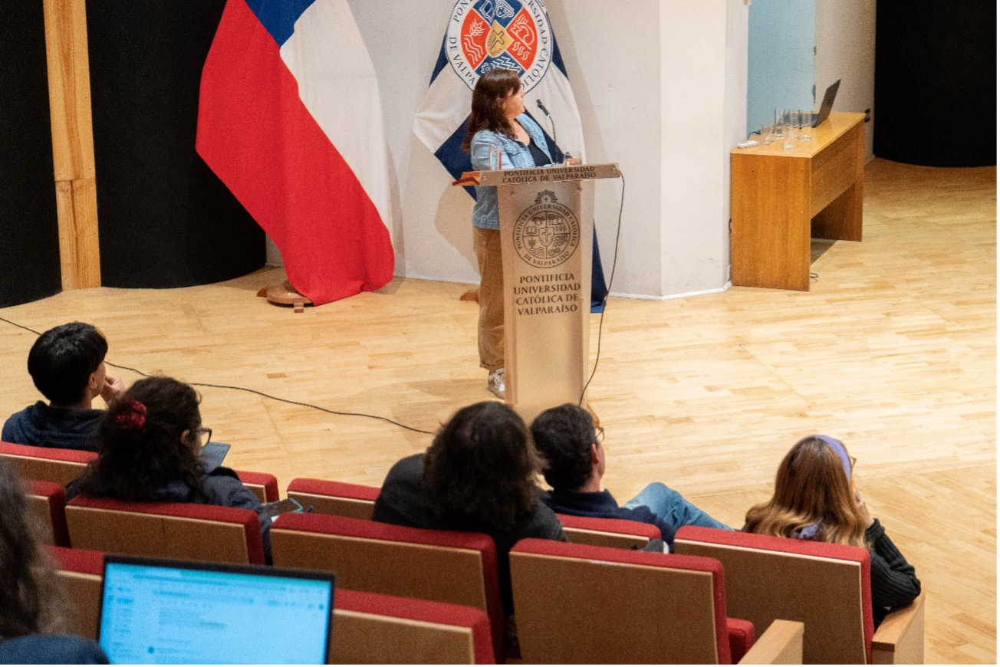
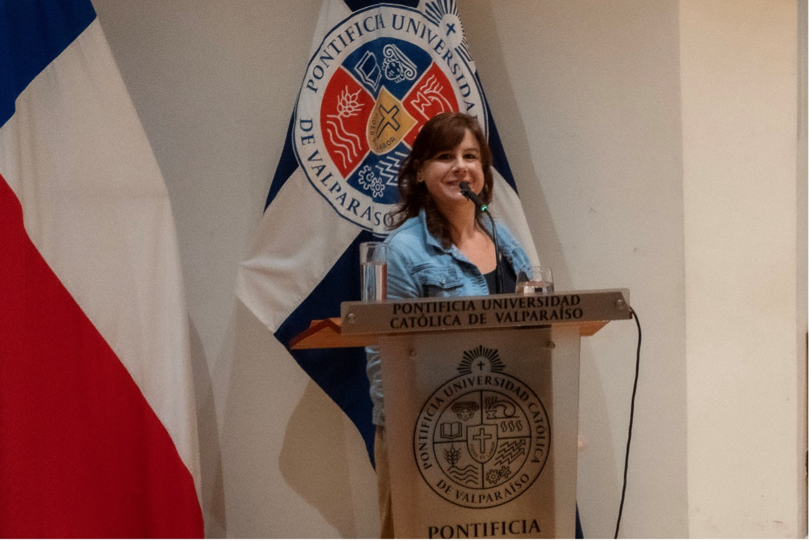
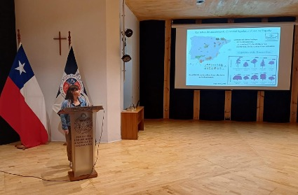

El pasado 21 de octubre de 2025, **[Luna Morcillo](../../people/morcillo_julia)** participó en un seminario internacional organizado por la [Pontificia Universidad Católica de Valparaíso](https://www.pucv.cl/) (Chile), en el marco del proyecto **FOVI 240271**: *Generando redes y capacidades de colaboración Chile–España para el estudio y la comprensión de la vulnerabilidad de bosques mediterráneos ante sequías intensas*, financiado por la Agencia Nacional de Investigación y Desarrollo (ANID) de Chile.

El objetivo del proyecto es fortalecer la colaboración científica entre Chile y España para avanzar en el estudio de la vulnerabilidad, el decaimiento y la mortalidad de los bosques mediterráneos frente a episodios de sequía extrema, un desafío creciente bajo el actual contexto de cambio climático.

El seminario, titulado [Vulnerabilidad a la sequía en bosques mediterráneos](https://www.pucv.cl/pucv/cientificos-de-chile-y-espana-se-reunen-para-abordar-la-vulnerabilidad), reunió a investigadoras e investigadores de ambos países y promovió un valioso intercambio de conocimientos, experiencias y aproximaciones metodológicas para abordar problemáticas forestales comunes.

Durante su intervención, *Decaimiento forestal ligado al clima en el sudeste de la Península Ibérica*, Luna Morcillo presentó brevemente la Red de Decaimiento Forestal (ReDeC), generando gran interés entre los y las asistentes.

::: {layout-ncol=3 layout-valign="center"}
{group="my-gallery"}

{group="my-gallery"}

{group="my-gallery"}
:::

