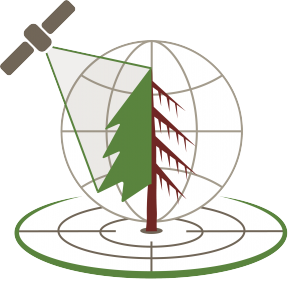

El próximo 24 de marzo de 2026 a las 16:00 CET, el profesor **[Jordi Martínez-Vilalta](../../people/lloret_francisco)** (Universitat Autònoma de Barcelona y Centro de Investigación Ecológica y Aplicaciones Forestales, CREAF) impartirá un seminario online dentro del ciclo de la [International Tree Mortality Network](https://www.tree-mortality.net/) titulado:

***Limits and opportunities in predicting drought-induced forest mortality***

En esta sesión, Jordi Martínez-Vilalta abordará los retos y avances en la predicción de la mortalidad forestal inducida por la sequía en un contexto de cambio climático. Aunque el seminario se centra en la dinámica de los bosques y los mecanismos fisiológicos implicados, también se informará sobre la Red Ibérica de Decaimeinto Forestal inducido por el Clima  ReDeC, en relación a la monitorización y comprensión de los impactos del cambio climático en los ecosistemas forestales.

Jordi Martínez-Vilalta es profesor de Ecología en la [Universitat Autònoma de Barcelona](https://web.ub.edu/es/) e investigador en [CREAF](https://www.creaf.cat/es). Su trayectoria científica se centra en el funcionamiento de los sistemas forestales, el transporte de agua y carbono en las plantas, la respuesta de los bosques al cambio ambiental y la predicción de la dinámica de la vegetación.

Mas información sobre el seminario en este [enlace](https://www.tree-mortality.net/seminars/) 

