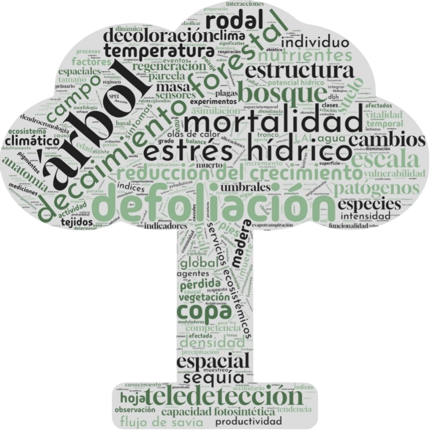

{fig-align="center" width="480"}


```{=html}
<style>

.decalogo-grid {
  display: flex;
  flex-direction: column;
  gap: 1.6rem;   
  margin-top: 1.5rem;
}

.decalogo-card {
  display: flex;
  align-items: flex-start;
  gap: 1rem;

  background: #f7f8f5;
  border: 1px solid #e2e6dc;
  border-left: 6px solid #2f5d50;
  border-radius: 16px;

  padding: 1.3rem;
  max-width: 720px;   
  
  margin-bottom: 1.6rem;
}

.decalogo-num {
  flex-shrink: 0;

  display: flex;
  align-items: center;
  justify-content: center;

  width: 2.4rem;
  height: 2.4rem;

  border-radius: 50%;
  background: #2f5d50;
  color: white;

  font-weight: 700;
}

.decalogo-text h3 {
  margin-top: 0;
  margin-bottom: 0.4rem;
}

.decalogo-text p {
  margin: 0;
  line-height: 1.6;
}
</style>
```

A continuación se muestra el decálogo para comprender el decaimiento forestal consensuado por los miembros de la red. También puedes descargar el documento en formato [PDF](../../sections/estandares_protocolos/decalogo_decaimiento.pdf).


### Definición y concepto de decaimiento propuesto por ReDeC


::: {.decalogo-card}
<div class="decalogo-num">1</div>
<div class="decalogo-text">

El **decaimiento forestal** es la reducción del vigor de un número elevado de árboles que habitan juntos en un mismo rodal, bosque o región por debajo de ciertos valores de referencia dependientes de la especie y el contexto ecológico, y que puede, o no, desembocar en una mortalidad de árboles generalizada por encima de la mortalidad basal[^*].

</div>

:::


::: {.decalogo-card}
<div class="decalogo-num">2</div>
<div class="decalogo-text">

Este fenómeno puede estar asociado a la **interacción de factores bióticos y abióticos**, sin que necesariamente exista un agente causal único.

</div>
:::

### Síntomas y manifestaciones

::: {.decalogo-card}
<div class="decalogo-num">3</div>
<div class="decalogo-text">


Presenta **sintomatología de estrés o daño** como decoloración, defoliación, cambios morfológicos, cambios en la evapotranspiración y disminución o alteraciones en los ritmos de crecimiento.

</div>
:::

::: {.decalogo-card}
<div class="decalogo-num">4</div>
<div class="decalogo-text">

La **magnitud y evolución** varían en cada caso, manifestándose uno o varios síntomas y pudiendo afectar parcial o totalmente a los árboles.

</div>
:::

### Causas y factores de estrés 

::: {.decalogo-card}
<div class="decalogo-num">5</div>
<div class="decalogo-text">

Es una **respuesta compleja al estrés** de múltiples factores actuando en conjunto o de forma aislada. Determinar los agentes causales principales es clave para su comprensión y gestión.

</div>
:::

::: {.decalogo-card}
<div class="decalogo-num">6</div>
<div class="decalogo-text">

Los factores causales principales pueden ser **abióticos** (sequía, temperaturas extremas, veranos más largos y secos, contaminación, condición del suelo, etc.) y **bióticos** (plagas, patógenos, competencia).

</div>
:::

::: {.decalogo-card}
<div class="decalogo-num">7</div>
<div class="decalogo-text">

Es parte de la **dinámica natural del ecosistema**, pero su aceleración, ocurrencia prematura en bosques jóvenes o gran magnitud pueden derivar en mortalidad masiva por estrés crónico o agudo.

</div>
:::

### Consecuencias, investigación y gestión

::: {.decalogo-card}
<div class="decalogo-num">8</div>
<div class="decalogo-text">

En muchos casos, favorece **enfermedades secundarias de origen biótico**, aumentando el impacto en el arbolado.
</div>
:::

::: {.decalogo-card}
<div class="decalogo-num">9</div>
<div class="decalogo-text">

La respuesta del bosque varía según su naturaleza, origen, diversidad y estructura. En general, los **bosques diversos son más resilientes** que las repoblaciones monoespecíficas.

</div>
:::

::: {.decalogo-card}
<div class="decalogo-num">10</div>
<div class="decalogo-text">

La **inversión en investigación** es clave para desarrollar sistemas de alerta temprana y herramientas integradas en la toma de decisiones para una mejor gestión forestal.

</div>
:::


::: {.decalogo-nota}
[^*]: **Nota.** Esta definición difiere de la aceptada en patología forestal, donde el decaimiento se define como una enfermedad de etiología compleja en la que agentes bióticos y abióticos actúan como factores de predisposición, incitación y contribución, desencadenando la muerte de los árboles sin que exista un agente primario único.
:::
