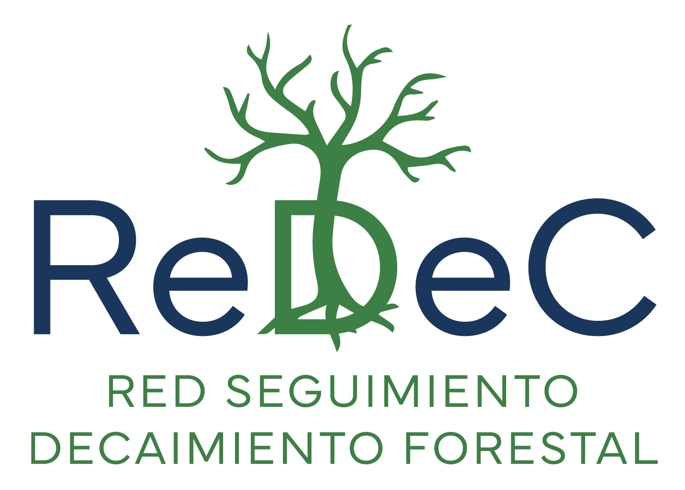

# III Jornadas Red Ibérica de Decaimiento Forestal Inducido por el Clima (ReDec) {.unnumbered .unlisted}

- Fecha: 15 (reunión interna), 16 (salida de campo) y 17 de Septiembre de 2026 (jornadas públicas)
- Lugar: Campus Duques de Soria, Universidad de Valladolid, SORIA (Salón de Grados) 

# Objetivos de la Reunión 

La tercera reunión de ReDec tiene como objetivo avanzar en las tareas de los grupos de trabajo de la red. La reunión se organiza en tres jornadas: la [primera](programa.qmd#sec-reunion-interna) centrada en debates entre los miembros de la red en torno a mesas de trabajo que engloban las actividades de ReDec; la [segunda jornada](programa.qmd#sec-visita-campo) donde se realizará una salida de campo para la visita de sitios con decaimiento en distintas masas forestales; y la [tercera jornada](programa.qmd#sec-reunion-publica) donde se realizará una jornada centrada en las Guías para la Gestión práctica de casos de Decaimiento Forestal.

# Reunión interna miembros de ReDec {#sec-reunion-interna}
###  Fecha y Lugar de Celebración
- 15 de septiembre de 2026 
- Lugar: [Campus Duques de Soria](https://maps.app.goo.gl/3CCp4Amm42XDoBPH8), Universidad de Valladolid, SORIA (Salón de Grados).   
- **[Enlace](https://teams.microsoft.com/meet/350630183982755?p=0YwM6utBWAUroJp4xN)** para conectarse por streaming. Id. de reunión: 350 630 183 982 755. Código de acceso: b9Tp7Uh7. 

## Programa

```{r}
#| echo: false
#| message: false
#| warning: false
library(tidyverse)
library(knitr)
library(gt)


raw <- readxl::read_excel("../../workshops/202609_soria/horario_workshop_soria.xlsx") |> 
  mutate(
    start = format(start, "%H:%M"),
    end   = format(end, "%H:%M")
  )

d  <- raw |> 
  unite("time", c("start", "end"), sep = " - ", remove = TRUE) |>
    rename(
        Hora = time, 
        Mesa = mesa,
        Coordina = coordinacion) |>
    mutate(
        Coordina = str_replace_all(Coordina,
    c("Francisco Lloret" = "[Francisco Lloret](../../people/lloret_francisco)", 
    "Paloma Ruiz-Benito" = "[Paloma Ruiz-Benito](../../people/ruiz_benito)",
    "Antonio J. Pérez-Luque" = "[Antonio J. Pérez-Luque](../../people/perez_luque)",
    "Antonio Gazol" = "[Antonio Gazol](../../people/gazol_burgos)",
    "Cristina Acosta" = "[Cristina Acosta](../../people/acosta_cristina)",
    "Lorena Gómez-Aparicio" = "[Lorena Gómez-Aparicio](../../people/gomez_aparicio)",
    "Jorge Curiel" = "[Jorge Curiel](../../people/curiel_jorge)",
    "Jordi Martínez-Vilalta" = "[Jordi Martínez-Vilalta](../../people/martinez_vilalta)", 
    "Julen Astigarraga" = "[Julen Astigarraga](../../people/astigarraga_julen)",
    "Miren del Río" = "[Miren del Río](../../people/del_rio)",
    "Rafael Calama" = "[Rafael Calama](../../people/calama_rafael)",
    "Marta Pardos" = "[Marta Pardos](../../people/pardos_marta)",
    "Raúl Sánchez Salguero" = "[Raúl Sánchez Salguero](../../people/sanchez_salguero)",
    "Gabriel Sangüesa" = "[Gabriel Sangüesa](../../people/saguesa_barreda/)",
    "Álvaro Cortés Molino" = "[Álvaro Cortés Molino](../../people/cortes_molino/)",
    "Raúl García Valdés" = "[Raúl García Valdés](../../people/garcia_valdes/)"
    ))
    
    ) |> 
  mutate(
    slides = if_else(
      !is.na(slides) & slides != "",
      slides,
      ""
    )
  )
```

```{r}
#| echo: false

# d15 <- d |> 
#     filter(day == 15) |> 
#     dplyr::select(-jornada, -day, Material = slides) 

d15 <- d |>
    filter(day == 15) |>
    dplyr::select(-jornada, -day, -slides)


gt::gt(d15) |> 
  gt::fmt_markdown(column = c(Coordina)) |>
  tab_style(
    style = cell_fill(color = "#dfece9"),
    locations = cells_body(
      rows = type == "break")
  ) |> 
  cols_hide(columns = type) |> 
  cols_width(
    "Hora" ~ pct(15),
    "Mesa" ~ pct(40),
    "Coordina" ~ pct(45)
  ) |> 
  sub_missing(
    columns = 3,
    missing_text = ""
  ) |> 
  tab_style(
    style = list(
      cell_text(weight = "bold")
    ),
    locations = cells_column_labels(everything())
  ) |> 
  as_raw_html()
```

:::{.callout-important}
# Streaming
https://teams.microsoft.com/meet/350630183982755?p=0YwM6utBWAUroJp4xN. 
Id. de reunión: 350 630 183 982 755. Código de acceso: b9Tp7Uh7.
::: 


# Jornada de Campo {#sec-visita-campo}

Salida de campo: visita a distintos rodales afectados por procesos de decaimiento derivados de la interacción entre factores bióticos y abióticos, como sequía, muérdago e insectos perforadores. A lo largo del recorrido se discutirán diferentes estrategias de gestión forestal adaptativa, incluyendo cambios de especie y cortas de regeneración. Finalmente, visitaremos parcelas de seguimiento para analizar la interacción entre sequía y procesionaria del pino sobre el funcionamiento y crecimiento de distintas especies de pino.

###  Fecha y Lugar de Celebración
- 16 de septiembre de 2026

# Tercera Jornada - Casos de estudio {#sec-reunion-publica}
###  Fecha y Lugar de Celebración
- 17 de septiembre de 2026 
- Lugar: [Campus Duques de Soria](https://maps.app.goo.gl/3CCp4Amm42XDoBPH8), Universidad de Valladolid, SORIA (Salón de Grados).   
- **[Enlace](https://teams.microsoft.com/meet/344712631918485?p=9NGpYcZhwOTgTPWnFR)** para conectarse por streaming.  
Id. de reunión: 344 712 631 918 485. Código de acceso: NZ2su65L


## Programa

```{r}
#| echo: false

d17 <- d |> 
  filter(day == 17) |> 
  dplyr::select(-jornada, -day, -slides)

gt::gt(d17) |> 
  fmt_markdown(colum = c(Coordina)) |>
  tab_style(
    style = cell_fill(color = "#dfece9"),
    locations = cells_body(
      rows = type == "break")
  ) |> 
  cols_hide(columns = type) |> 
  cols_width(
    "Hora" ~ pct(15),
    "Mesa" ~ pct(40),
    "Coordina" ~ pct(45)
  ) |> 
  sub_missing(
    columns = 3,
    missing_text = ""
  ) |> 
  tab_style(
    style = list(
      cell_text(weight = "bold")
    ),
    locations = cells_column_labels(everything())
  ) |> 
  as_raw_html()
```

:::{.callout-important}
# Streaming
[https://teams.microsoft.com/meet/344712631918485?p=9NGpYcZhwOTgTPWnFR](https://teams.microsoft.com/meet/344712631918485?p=9NGpYcZhwOTgTPWnFR)
Id. de reunión: 344 712 631 918 485. Código de acceso: NZ2su65L
::: 

# Organiza 

::: {layout-ncol="2" fig-align="center" layout-valign="center"}

[{width=350}](https://decaimiento.es/)
[{width=350}](https://www.aei.gob.es/convocatorias/buscador-convocatorias/redes-investigacion-2024/publicaciones)
[{width=350}](https://www.creaf.cat/es)

[{width=300}](https://uah.es/es/)
[{width=300}](https://eifab.uva.es/)
[{width=300}](https://www.cambiumresearch.eu/)
[{width=300}](https://iufor.uva.es/) 

:::
